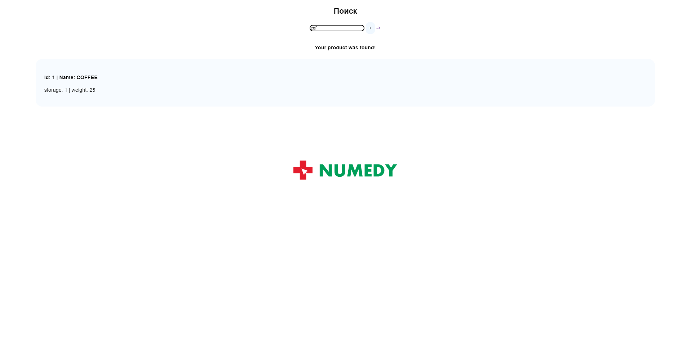

# Документация для сервиса управления продуктами и хранилищами

## Используемый стек:
- MQTT (MOSQUITTO) - шина для обмена сообщениями
- FastApi - веб фреймворк
- Uvicorn - ASGI - асинхронный шлюз
- Alembic - для реализации миграций
- SQLAlchemy - ORM для работы с бд
- Docker - для контейнеризации и удобного развертывания сервиса

## Инструкция по развертыванию
Для развертывания Вам необходимо:
 - Собрать контейнеры при помощи команды `docker compose up --build`
 - Подключиться к контейнеру `numedy-server`, для этого нужно узнать "container id" через команду `docker ps -a`. Далее, требуется ввести команду `docker exec -it *"container id"* sh`  
 - Внести данные в бд при помощи миграций. Для этого введите команду `alembic upgrade 131934977d7d`
  
После описанных действий вы располагаете сервисом наполненным данными. Дальнейшее описание будет представлять описание проекта.

## Структура проекта

```
Numedy
├── alembic/
├── core 
├── docker
├── helpers
├── interfaces
├── migrations
├── static
├── var
├── alembic.ini
├── .gitignore
├── docker-compose.yml
├── Dockerfile
├── exec.sh
├── main.py
├── src
│   ├── calculation_mass_src
│   │   ├── __init__.py
│   │   ├── main.py
│   │   ├── prepare.py
│   │   └── service.py 
│   ├── models
│   │   ├── __init__.py
│   │   ├── base.py
│   │   ├── db_helpers.py
│   │   ├── product.py
│   │   ├── storage.py
│   │   └── users.py
│   ├── service_src
│   │   ├── __init__.py
│   │   ├── main.py
│   │   ├── base_broker_connector.py
│   │   └── server
│   │   │   ├── users
│   │   │   │   ├── actions.py
│   │   │   │   ├── routes.py
│   │   │   │   └── schemas.py
│   │   │   ├── warehouse
│   │   │   │   ├── __init__.py
│   │   │   │   ├── routes.py
│   │   │   │   ├── prepare.py
│   │   │   │   ├── dependencies.py
│   │   │   │   ├── actions.py
│   │   │   │   ├── broker_connector.py
│   │   │   │   └── schemas.py
│   │   │   ├── routes.py
│   │   │   └── prepare.py
└── req.txt
```

### Основной сервис 

Адрес в структуре: /src/server_src

Данный сервис отвечает за обработку запросов от пользователей

```
│   ├── service_src
│   │   ├── __init__.py
│   │   ├── main.py
│   │   ├── base_broker_connector.py
│   │   └── server
│   │   │   ├── users
│   │   │   │   ├── actions.py
│   │   │   │   ├── routes.py
│   │   │   │   └── schemas.py
│   │   │   ├── warehouse
│   │   │   │   ├── __init__.py
│   │   │   │   ├── routes.py
│   │   │   │   ├── prepare.py
│   │   │   │   ├── dependencies.py
│   │   │   │   ├── actions.py
│   │   │   │   ├── broker_connector.py
│   │   │   │   └── schemas.py
│   │   │   ├── routes.py
│   │   │   └── prepare.py
```

main - точка входа, отвечает за сборку всех роутеров, запуск sqlalchemy engine
 
base_broker_connector.py - представляет базовый коннектор к шине mqtt

server/ - директория с разнесенными модулями 

server/warehouse - директория c роутами, схемами и зависимостями для обращения к микросервису управления хранилищами

server/users - директория c роутами, схемами и зависимостями для обращения к микросервису управления пользователями  


### Сервис управления хранилищами 

Адрес в структуре: /src/calculation_mass_src

```
│   ├── calculation_mass_src
│   │   ├── __init__.py
│   │   ├── main.py
│   │   ├── prepare.py
│   │   └── service.py 
```

main - точка входа, запускает сервис

service - основной файл сервиса отвечает за обработку принятых сообщений, а также производит основные операции с базой данных.


## Инструкция пользователя

Для начала работы перейдите по адресу `http://127.0.0.1:8000/`

Вас встретит главная страница


При вводе имени товара, будет выданы все совпадения по имени без учета регистра



При клике на товар, будет показан попап с удалением текущего продукта


После удаления товаров обновим запрос, данный продукт был удален 


Нажмем на кнопку со стрелочкой
Вас встретит страница управления хранилищами


При вводе адреса хранилища будут выданы все совпадения 


При нажатии на хранилище будет показан попап


После нажатия на кнопку удаления обновим запрос


На странице продуктов добавим новый продукт


Проверим результат добавления. Наш продукт был успешно добавлен. Проверим на странице хранилищ статусы


Перейдем на страницу хранилищ и найдем хранилище под индексом 3


Как мы видим, вес в хранилище равен сумме расположенных в нем продуктов.


## Подключение базы данных

Для подключения к базе необходимо выполнить следующие команды
 - Необходимо подключиться к контейнеру с `numedy-postgre`, для этого нужно узнать "container id" через команду `docker ps -a`. Далее, требуется ввести команду `docker exec -it *"container id"* bash`  
 - После подключения к контейнеру необходимо ввести команды: `psql -U postgres`
 - Далее необходимо ввести: `\с numedy_test_task`
 - Теперь вы можете исполнять sql запросы, не стоит забывать о ";"